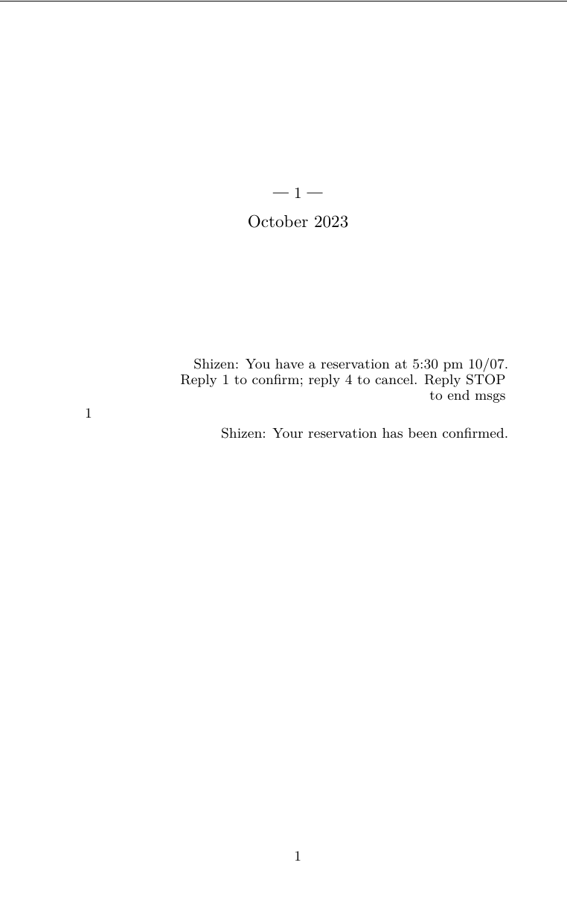
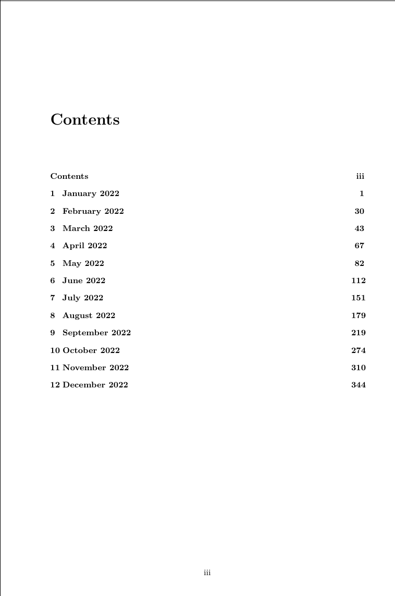

# message-book

This is a tool to make a book out of a given iMessage conversation. To use it, you need either
an iPhone backup or a Mac that holds all the messages you want included. To use the tool, clone the repo and run: 

```
cargo run -- --help
```

The code is in pretty rough shape, but it should do the job. Let me know if you run into any issues.

An example of the output can be seen in the [example-output](example-output) directory.




